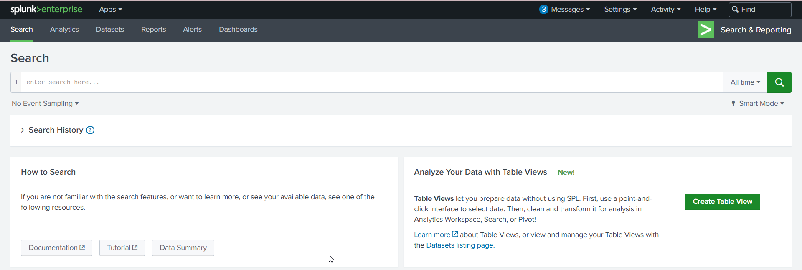

# Boss Of The SOC v1 Lab

## **Scenario**

Instructions:

- Please allow a few minutes for the service to start.
- Ensure that there are no blockers, such as Adblock extensions, that might prevent the lab from opening in a new tab or affect lab’s functionality.

Scenario 1 (APT):

The focus of this hands on lab will be an APT scenario and a ransomware scenario. You assume the persona of Alice Bluebird, the soc analyst who has recently been hired to protect and defend Wayne Enterprises against various forms of cyberattack.

Today is Alice's first day at the Wayne Enterprises' Security Operations Center. Lucius sits Alice down and gives her first assignment: A memo from Gotham City Police Department (GCPD). Apparently GCPD has found evidence online ([http://pastebin.com/Gw6dWjS9](http://pastebin.com/Gw6dWjS9)) that the website www.imreallynotbatman.com hosted on Wayne Enterprises' IP address space has been compromised. The group has multiple objectives... but a key aspect of their modus operandi is to deface websites in order to embarrass their victim. Lucius has asked Alice to determine if www.imreallynotbatman.com. (the personal blog of Wayne Corporations CEO) was really compromised.

In this scenario, reports of the below graphic come in from your user community when they visit the Wayne Enterprises website, and some of the reports reference "P01s0n1vy." In case you are unaware, P01s0n1vy is an APT group that has targeted Wayne Enterprises. Your goal, as Alice, is to investigate the defacement, with an eye towards reconstructing the attack via the Lockheed Martin Kill Chain.


---

Scenario 2 (Ransomeware):

In the second scenario, one of your users is greeted by this image on a Windows desktop that is claiming that files on the system have been encrypted and payment must be made to get the files back. It appears that a machine has been infected with Cerber ransomware at Wayne Enterprises and your goal is to investigate the ransomware with an eye towards reconstructing the attack.


### Q1: This is a simple question to get you familiar with submitting answers. What is the name of the company that makes the software that you are using for this competition? Just a six-letter word with no punctuation.



Answer: splunk

### Q2: Web Defacement: What content management system is imreallynotbatman.com likely using? (Please do not include punctuation such as . , ! ? in your answer. We are looking for alpha characters only.)

Spunk query: 

```jsx
index=* "[imreallynotbatman.com](http://imreallynotbatman.com/)" sourcetype="stream:http"
```


Answer: joomla

### Q3: Web Defacement: What is the likely IP address of someone from the Po1s0n1vy group scanning imreallynotbatman.com for web application vulnerabilities?

Spunk query: 

```jsx
index=* "[imreallynotbatman.com](http://imreallynotbatman.com/)" sourcetype="stream:http"
```


Spunk query: 

```jsx
index=* "[imreallynotbatman.com](http://imreallynotbatman.com/)" sourcetype="stream:http" c_ip="40.80.148.42" http_method=GET
| table _time c_ip uri_path status
| sort 0 _time
```


Answer: 40.80.148.42

### Q4: Web Defacement: What company created the web vulnerability scanner used by Po1s0n1vy? Type the company name. (For example, "Microsoft" or "Oracle")

Spunk query: 

```jsx
index=* "[imreallynotbatman.com](http://imreallynotbatman.com/)" sourcetype="stream:http" c_ip="40.80.148.42" http_method=GET
```


Answer: acunetix

### Q5: Web Defacement: What IP address is likely attempting a brute force password attack against [imreallynotbatman.com](http://imreallynotbatman.com/)?

Spunk query: 
`index=* "imreallynotbatman.com" sourcetype="stream:http" "password”`


Spunk query: 

```jsx
index=* "imreallynotbatman.com" sourcetype="stream:http" c_ip="23.22.63.114" http_method=POST
```


Answer: 23.22.63.114

### Q6: Web Defacement: What was the first brute force password used?

Spunk query: 

```jsx
index=* "[imreallynotbatman.com](http://imreallynotbatman.com/)" sourcetype="stream:http" c_ip="23.22.63.114" http_method=POST
| table _time, form_data
```


Answer: 12345678

### Q7: Web Defacement: What is the name of the executable uploaded by Po1s0n1vy? Please include the file extension. (For example, "notepad.exe" or "favicon.ico")

Spunk query: 

```jsx
index=* "[imreallynotbatman.com](http://imreallynotbatman.com/)" "40.80.148.42" http_method=POST "*.exe"
```


Answer: 3791.exe

### Q8: Web Defacement: What is the MD5 hash of the executable uploaded?

Splunk query: 

```jsx
index=* "3791.exe" source="WinEventLog:Microsoft-Windows-Sysmon/Operational" EventCode=1 Image="C:\\inetpub\\wwwroot\\joomla\\3791.exe”
```


Answer: AAE3F5A29935E6ABCC2C2754D12A9AF0

### Q9: Web Defacement: What was the correct password for admin access to the content management system running "imreallynotbatman.com"?

Splunk query:

```jsx
index="botsv1" sourcetype="stream:http"
"23.22.63.114"
"\"http_method\":\"GET\""
"\"uri\":\"/joomla/administrator/index.php\""
"\"cookie\":\"" 
```


Splunk query:

```jsx
index="botsv1" sourcetype="stream:http" "23.22.63.114" http_method="POST" "7598a3465c906161e060ac551a9e0276=2ekei8hdifl20molu8rni80ji1”
```


Answer: batman

### Q10:  Web Defacement: What is the name of the file that defaced the [imreallynotbatman.com](http://imreallynotbatman.com/) website? Please submit only the name of the file with the extension (For example, "notepad.exe" or "favicon.ico").

Splunk query:

```
index="botsv1" sourcetype="stream:http" c_ip="192.168.250.70”
```


Answer: poisonivy-is-coming-for-you-batman.jpeg

### Q11: Web Defacement: This attack used dynamic DNS to resolve to the malicious IP. What is the fully qualified domain name (FQDN) associated with this attack?

Answer: prankglassinebracket[.]jumpingcrab[.]com 

### Q12: Web Defacement: What IP address has Po1s0n1vy tied to domains that are pre-staged to attack Wayne Enterprises?


Answer: 23.22.63.114

### Q13: Web Defacement: Based on the data gathered from this attack and common open-source intelligence sources for domain names, what is the email address most likely associated with the Po1s0n1vy APT group?


Answer: lillian[.]rose@po1s0n1vy[.]com

### Q14: Web Defacement: GCPD reported that common TTP (Tactics, Techniques, Procedures) for the Po1s0n1vy APT group, if initial compromise fails, is to send a spear-phishing email with custom malware attached to their intended target. This malware is usually connected to Po1s0n1vy's initial attack infrastructure. Using research techniques, provide the SHA256 hash of this malware.


Answer: 9709473ab351387aab9e816eff3910b9f28a7a70202e250ed46dba8f820f34a8

### Q15: Web Defacement: What was the average password length used in the password brute-forcing attempt? (Round to a closest whole integer. For example "5" not "5.23213")

Splunk query: 

```
index="botsv1" sourcetype="stream:http" c_ip="23.22.63.114" http_method="POST"
| rex field="form_data" "passwd=(?<passwd>.+?(?=&|$))"
| eval passwd_len = len(passwd)
| stats avg(passwd_len) as avg_passwd_len
| eval avg_passwd_len = round(avg_passwd_len,2)
```


Answer: 6.17

### Q16: Web Defacement: How many seconds elapsed between the brute force password scan identified the correct password and the compromised login? Round to 2 decimal places.

Splunk query:

```jsx
index="botsv1" sourcetype="stream:http" http_method="POST"
| rex field="form_data" "passwd=(?<passwd>.+?(?=&|$))"
| search passwd="batman"
| table _time, c_ip, passwd
```


Answer: 92.17

### Q17: Web Defacement: How many unique passwords were attempted in the brute force attempt?

Splunk query:

```jsx
index="botsv1" sourcetype="stream:http"
"23.22.63.114"
"\"http_method\":\"POST\""
"\"uri\":\"/joomla/administrator/index.php\""
| stats count by c_ip
```


### Q18: Ransomware: What fully qualified domain name (FQDN) makes the Cerber ransomware attempt to direct the user to at the end of its encryption phase?

Splunk query:

```jsx
index="botsv1" source = /var/log/suricata/eve.json "alert.signature"="ETPRO TROJAN Ransomware/Cerber Onion Domain Lookup”
```


Splunk query:

```jsx
index="botsv1" source="/var/log/suricata/eve.json"
flow_id=4097325782
| table _time event_type src_ip src_port dest_ip dest_port dns.type dns.rrname dns.rrtype alert.signature
| sort _time
```


Answer: cerberhhyed5frqa[.]xmfir0[.]win	

### Q19: Ransomware: What was the most likely IP address of we8105desk in 24AUG2016?

Splunk query:

```jsx
index="botsv1" host=we8105desk
```


Answer: 192.168.250.100

### Q20: Ransomware: Amongst the Suricata signatures that detected the Cerber malware, which one alerted the fewest number of times? Submit ONLY the signature ID value as the answer. (No punctuation, just 7 integers.)

Splunk query

```jsx
index="botsv1" source = /var/log/suricata/eve.json "*Cerber*"| stats count by alert.signature alert.signature_id
```


Answer: 2816763

### Q21: Ransomware: During the initial Cerber infection a VB script is run. The entire script from this execution, pre-pended by the name of the launching .exe, can be found in a field in Splunk. What is the length in characters of the value of this field?

Splunk query:

```jsx
index=* source="WinEventLog:Microsoft-Windows-Sysmon/Operational" EventCode=1 "*.vbs”
```


Spunk query:

```jsx
index=* source="WinEventLog:Microsoft-Windows-Sysmon/Operational" EventCode=1 "*.vbs" ParentImage="C:\\Program Files (x86)\\Microsoft Office\\Office14\\WINWORD.EXE"
| eval Commandlen=len(CommandLine)
| table _time CommandLine, Commandlen
```


Answer: 4490

### Q22: Ransomware: The VBScript found in question 21 launches 121214.tmp. What is the ParentProcessId of this initial launch?

Splunk query:

```jsx
index=* source="WinEventLog:Microsoft-Windows-Sysmon/Operational" EventCode=1 "121214.tmp" ParentImage="C:\\Windows\\SysWOW64\\wscript.exe”
```


Answer: 3968

### Q23: Ransomware: The malware downloads a file that contains the Cerber ransomware crypto code. What is the name of that file?

Splunk query:

```jsx
index="botsv1" sourcetype="fgt_utm" srcip="192.168.250.100"
| where eventtype="infected"
| table _time srcip dstip srcport dstport action service filename url virus msg
```


Answer: mhtr.jpg

### Q24: Ransomware: What is the name of the USB key inserted by Bob Smith?

Splunk query:

```jsx
index=botsv1 "usbstor”
```


Splunk query:

```jsx
index="botsv1" host="we8105desk"
"7d961196"
(registry_value_name="FriendlyName"
OR registry_value_name="Label"
OR registry_value_name="VolumeLabel"
OR registry_value_name="DeviceDesc"
OR registry_value_name="DeviceName")
| table _time key_path registry_value_name
registry_value_data data _raw
| sort 0 _time
```


Answer: MIRANDA_PRI

### Q25: Ransomware: Bob Smith's workstation (we8105desk) was connected to a file server during the ransomware outbreak. What is the IP address of the file server?

Splunk query:

```jsx
index=botsv1 sourcetype=winregistry fileshare
```


Answer: 192.168.250.20

### Q26: Ransomware: How many distinct PDFs did the ransomware encrypt on the remote file server?

Splunk query:

```jsx
index="botsv1" source="WinEventLog:" host=we9041srv EventCode=5145 Relative_Target_Name=".pdf" WriteData
```


Answer: 257

### Q27: Ransomware: The Cerber ransomware encrypts files located in Bob Smith's Windows profile. How many .txt files does it encrypt?

```jsx
index="botsv1" host=we8105desk source="WinEventLog:Microsoft-Windows-Sysmon/Operational" TargetFilename="C:\\Users\\bob.smith.WAYNECORPINC\\*.txt”
```


Answer: 406

### Q28: Ransomware: What was the first suspicious domain visited by we8105desk in 24AUG2016?

Splunk query:

```jsx
index=* source="stream:dns" src_ip="192.168.250.100" query_type{}=A
| table _time event_type src_ip src_port dest_ip dest_port query_type{} query{}
| sort _time
```


Splunk query:

```jsx
index=* [solidaritedeproximite.org](http://solidaritedeproximite.org/) source="/var/log/suricata/eve.json"
```


Answer: solidaritedeproximite[.]org