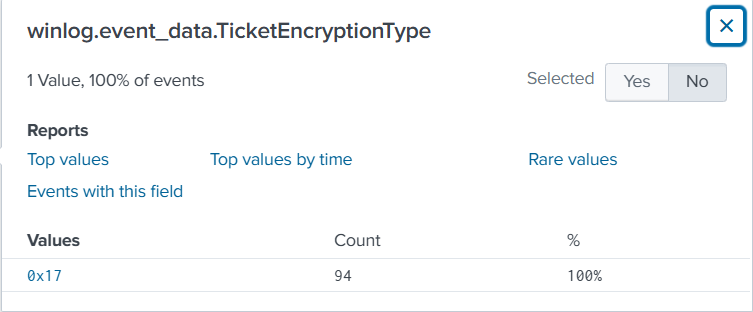

# Kerberoasted Lab

## **Scenario**

As a diligent cyber threat hunter, your investigation begins with a hypothesis: 'Recent trends suggest an upsurge in Kerberoasting attacks within the industry. Could your organization be a potential target for this attack technique?' This hypothesis lays the foundation for your comprehensive investigation, starting with an in-depth analysis of the domain controller logs to detect and mitigate any potential threats to the security landscape.

Note: Your Domain Controller is configured to audit Kerberos Service Ticket Operations, which is necessary to investigate kerberoasting attacks. Additionally, Sysmon is installed for enhanced monitoring.

### Q1: To mitigate Kerberoasting attacks effectively, we need to strengthen the encryption Kerberos protocol uses. What encryption type is currently in use within the network?

Splunk query:

```jsx
index="kerberoasted" "event.code"=4768
```

**4768: A Kerberos authentication ticket (TGT) was requested.**




Answer: RC4-HMAC

### Q2: What is the username of the account that sequentially requested Ticket Granting Service (TGS) for two distinct application services within a short timeframe?

Splunk query: 

```jsx
index="kerberoasted" "event.code"=4769
| table _time, winlog.event_data.TargetUserName, winlog.event_data.ServiceName
```


Answer: johndoe

### Q3: We must delve deeper into the logs to pinpoint any compromised service accounts for a comprehensive investigation into potential successful kerberoasting attack attempts. Can you provide the account name of the compromised service account?


Splunk query:

```jsx
index="kerberoasted" "event.code"=4624 "winlog.event_data.IpAddress"="10.0.0.154" "winlog.event_data.LogonType"=3
```


Answer SQLService

### Q4 To track the attacker's entry point, we need to identify the machine initially compromised by the attacker. What is the machine's IP address?


Answer: 10.0.0.154

### Q5: To understand the attacker's actions following the login with the compromised service account, can you specify the service name installed on the Domain Controller (DC)?

Splunk query:

```jsx
index="kerberoasted" "event.code"=7045
```


Answer: [iOOEDsXjWeGRAyGl](https://7418b4ca-581a-448f-9f2b-2e365e65c508.cyberdefenders.network/en-US/app/search/search?q=search%20index%3D%22kerberoasted%22%20%22event.code%22%3D7045&display.page.search.mode=smart&dispatch.sample_ratio=1&workload_pool=&earliest=0&latest=now&display.page.search.tab=events&display.general.type=events&display.prefs.fieldFilter=status&sid=1784538625.77#)

### Q6: To grasp the extent of the attacker's intentions, What's the complete registry key path where the attacker modified the value to enable Remote Desktop Protocol (RDP)?

Splunk query:

```jsx
index="kerberoasted" "event.code"=1 "reg.exe"
| table _time, winlog.event_data.CommandLine
```


Answer: HKLM\System\CurrentControlSet\Control\Terminal Server\fDenyTSConnections

### Q7: To create a comprehensive timeline of the attack, what is the UTC timestamp of the first recorded Remote Desktop Protocol (RDP) login event?

Splunk query:

```jsx
index="kerberoasted" "event.code"=4624 "winlog.event_data.LogonType"=10
```


Answer: 2023-10-16 07:50

### Q8: To unravel the persistence mechanism employed by the attacker, what is the name of the WMI event consumer responsible for maintaining persistence?

Splunk query:

```jsx
index="kerberoasted" "event.code"=20
```


Answer: Updater

### Q9: Which class does the WMI event subscription filter target in the WMI Event Subscription you've identified?

Splunk query:

```jsx
index="kerberoasted" "event.code"=19
```


Answer: Win32_NTLogEvent
