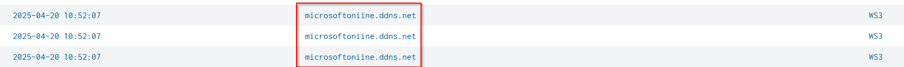

# Rhysida - Vice Society Lab

# **Scenario**

A system administrator unknowingly submitted their credentials to a realistic phishing page disguised as a Microsoft login portal. Within hours, multiple login attempts from external sources were observed using this privileged account. Internal monitoring soon flagged unusual process activity, registry modifications, and outbound traffic to unfamiliar destinations. Remote administration tools appeared across critical systems, and event logs began vanishing. The SOC suspects a full compromise is underway—spanning initial access, persistence, lateral movement, and potentially ransomware deployment. Your task is to uncover the attacker’s path, identify persistence mechanisms, and assess the scope of data access and exfiltration.

# **Initial Access & Execution**

## Q1: What is the domain of the phishing page that captured the administrator’s credentials?

Splunk query: 

`index=* source= XmlWinEventLog:Microsoft-Windows-Sysmon/Operational EventCode=22
| table _time, query, host`

## Q2: Following an unauthorized SSH login, a file appeared on the system, likely transferred via SCP or SFTP using OpenSSH. What is the Process ID of the process that wrote the file to disk?

Splunk query:

`index=* source= XmlWinEventLog:Microsoft-Windows-Sysmon/Operational EventCode=29 host="WS3"
| table _time, Image, ProcessId, TargetFilename`

## Q3: After stealing the credentials, the attacker attempted to authenticate to the system using a specific protocol. What service was used to gain initial access?

Splunk query: `index=* EventCode=4624 host="WS3”`

## Q4: Based on log analysis, what was the exact timestamp of the attacker’s first success login attempt using the compromised account?

Splunk query:

`index=* EventCode=4624 host="WS3" eventtype=windows_logon_success Logon_Type=3 process_name="C:\\Program Files\\OpenSSH\\sshd-session.exe”`

## Q5: An attempt to use a deprecated download method failed. The attacker then switched to a native Windows utility to fetch their payloads. Which tool was successfully used?

`index=* EventCode=1 host="WS3" "WindowsUpdate.dll"
| table _time, ParentImage, ParentCommandLine, Image, CommandLine, CurrentDirectory`

# **Persistence & Defense Evasion**

## Q6: To maintain persistence, the attacker created a registry value with a legitimate-sounding name. What is the name of the registry value used for persistence?

Splunk query: `index=* EventCode=13 host="WS3" "WindowsUpdate.dll”`

## Q7: To evade detection, the attacker executed a command to disable endpoint protection. What command was used to weaken real-time monitoring?

Splunk query: 
`index=* EventCode=1 host="WS3" "WindowsUpdate.dll"
| table _time, ParentImage, ParentCommandLine, Image, CommandLine, CurrentDirectory`

## Q8:  The attacker disabled system auditing entirely. What command-line utility was used to achieve this?

Splunk query like Q7

## Q9: Log records indicate several event categories were erased from the system. What logs did the attacker clear to cover their tracks?

Splunk query like Q7

# **Credential Access & Privilege Escalation**

## Q10: A credential-dumping utility was executed to extract browser-stored credentials. What is the SHA256 hash of the malicious binary used?

Splunk query: : 
`index=* EventCode=1 "WindowsUpdate.dll"
| table _time, ParentImage, ParentCommandLine, Image, CommandLine, CurrentDirectory, host` 

Splunk query: `index=* "BCleaner.exe" EventID=29` 

## Q11: While expanding control over the network, a file containing dumped credentials was created. What is the name of the file used to store the stolen credentials?

Splunk query:
`index=* EventCode=1 host="WS3" "WindowsUpdate.dll"
| table _time, ParentImage, ParentCommandLine, Image, CommandLine, CurrentDirectory`

## Q12: A failed credential dumping attempt triggered security alerts. What is the **`ProcessId`** of the process that performed this failed action?

Splunk query: 

`index=* EventCode=1 "WindowsUpdate.dll"
| table _time, ParentImage, ParentCommandLine, Image, CommandLine, CurrentDirectory,host`

Splunk query: 

`index=* EventCode=1 "WindowsUpdate.dll"  CommandLine="C:\\Windows\\system32\\cmd.exe /C ntdsutil \"activate instance ntds\" \"ifm\" \"create full C:\\temp_l0gs\" q q”`

## Q13: To restrict access to the remote session, the attacker configured a password. What password was set for the remote tool?

Splunk query: 

`index=* EventCode=1 host="WS3" "WindowsUpdate.dll"
| table _time, ParentImage, ParentCommandLine, Image, CommandLine, CurrentDirectory`

# **Lateral Movement & Command and Control (C2)**

## Q14: During lateral movement, the attacker used a service-based technique to execute commands on remote systems. What MITRE sub-technique did they use?

Splunk query: Like Q13

## **Q15: To establish ongoing access, a command and control beacon was deployed. What is the IP address of the C2 server the system communicated with?**

Splunk query: `index=* EventCode=3`

Splunk query: `index=* EventCode=3 DestinationIp="3.70.203.137”`

## Q16: A remote access tool was dropped on the system, allowing full remote control. What is the name of this tool?

Splunk query: 

`index=* EventCode=1 host="WS3" "WindowsUpdate.dll"
| table _time, ParentImage, ParentCommandLine, Image, CommandLine, CurrentDirectory`

## Q17: After establishing the remote access session, the attacker issued a command to retrieve system-specific identifiers. What argument was passed to the tool?

Splunk query: 

`index=* EventCode=1 host="WS3" "AnyDesk"
| table _time, ParentImage, ParentCommandLine, Image, CommandLine, CurrentDirectory` 

# **Exfiltration**

## Q18: Sensitive documents were collected and saved in a public directory. What is the full file path of the text file used to store this staged data?

Splunk query: 

`index=* EventCode=1 host="DC01"  "WindowsUpdate.dll"
| table _time, ParentImage, ParentCommandLine, Image, CommandLine, CurrentDirectory`

## Q19: The attacker compressed the collected data into a single archive file for extraction. What is the name of the archive file?

Splunk query: 

`index=* EventCode=1 host="DC01"  "WindowsUpdate.dll"
| table _time, ParentImage, ParentCommandLine, Image, CommandLine, CurrentDirectory`

# **Impact**

## Q20: A ransomware payload was deployed to cause maximum damage. What is the name of the malicious executable launched during the final stage of the attack?

Splunk query: 

`index=* EventCode=29 host="DC01"
| table _time, TargetFilename`

## Q21: Instead of dropping a typical ransom note, the attacker left behind a uniquely named file. What is the name of the note that was dropped?

Splunk query: `index=* EventCode=11 host="DC01”`

## Q22: After compromising the domain controller, the attacker stored tools in a sensitive location. What is the full path of the directory used for staging their tools?

