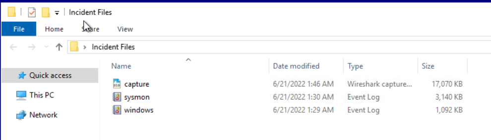

# Lab: Tempest

In this incident, you will act as an Incident Responder from an alert triaged by one of your Security Operations Center analysts. The analyst has confirmed that the alert has a **CRITICAL** severity that needs further investigation.

As reported by the SOC analyst, the intrusion started from a malicious document. In addition, the analyst compiled the essential information generated by the alert as listed below:

- The malicious document has a **.doc** extension.
- The user downloaded the malicious document via **chrome.exe**.
- The malicious document then executed a chain of commands to attain code execution.

In this lab, i have 3 filse include 1 pcap and 2 .evtk files

In this lab I used this tool to analyst:

- Wireshark
- EvtxEcmd & Timeline Explorer
- Cyberchef

To parse the provided logs, we need first to convert the EVTX logs into CSV using EvtxEcmd and then feed it into Timeline Explorer.

Commandline: **.\EvtxECmd.exe -f 'C:\Users\user\Desktop\Incident Files\sysmon.evtx' --csv 'C:\Users\user\Desktop\Incident Files' --csvf sysmon.csv**

## Initial Access - Malicious Document and execution

To investigate this phase, I filtered with **EventID = 1** (ProcessCreate) and **Executable = .doc** to search for the name of the malicious document, and we can see 1 event with **ProcessID = 496**

User benimaru opened a malicious document file named **free_magicules.doc.** 

With the PID above, we can continue filtering with PPID = 496 to see what this malicious document has done. It is observed that the attacker exploited the security vulnerability CVE-2022-30190 to execute arbitrary code on the victim’s system. The vulnerability that exists within msdt.exe is the Microsoft Support Diagnostic Tool. Normally, this tool is used to diagnose faults with the operating system and then report and provide system details back to Microsoft Support. The vulnerability allows a malicious actor to effectively execute arbitrary code with the same privileges as the application calling it. As has been the case with the original reporting of this from @nao_sec and subsequent experimentation in the wider security community, the calling application is quite often a tool in Microsoft Office (Word, Excel, Outlook, etc.)

You can see detail about that vuln on: [https://www.fortinet.com/blog/threat-research/analysis-of-follina-zero-day](https://www.fortinet.com/blog/threat-research/analysis-of-follina-zero-day)

After decoding with cyberchef, we obtain the following code content:

The above code downloads the update.zip file from a malicious URL into the Startup folder, then extracts update.zip from the Startup folder, allowing it to automatically run every time a user successfully logs into the computer. Finally, it erases any traces of the operation. Since the malicious program will execute every time the victim turns on their computer, further investigation into its behavior is necessary. After some research, I discovered that programs stored in the Startup folder are executed later in the process tree shown below.

Therefore, by simply filtering with the **Commandline field as explore.exe**, we can obtain more information about this malicious program.

We can see a strange process continuously downloading an executable file named first.exe from the malicious domain, just like in the document we saw earlier, and then executing that file. From this, we can confirm that it is a process originating from the malicious program.

Continuing to filter by **first.exe**, we see many unusual DNS queries to **[resolvecyber[.]xyz]** with ip **167[.]71[.]222[.]162** , possibly indicating a C2 server. To investigate further, we use Wireshark. Let's start by filtering using the HTTP protocol and the destination IP address we already know above.

Oh that's so strange!! Numerous GET requests are being sent to the URL /9ab62b5 with queries that appear to be base64 encoded. Let's save all of that and let Cyberchef handle the rest. 

We can see that this is the output of the probing commands sent from the victim's machine to the C2 server. By analyzing this output, we can investigate what the hacker knew and exploited.

## **Discovery - Internal Reconnaissance**

The hacker found and read a file containing sensitive information, including Benimaru's username and password.

Next, the hacker explored which ports and services were open, thereby discovering potential vulnerabilities on the victim's machine.

The hacker then downloaded a new executable file, ch.exe. By filtering by the executable file name, we see that the hacker used this file to establish a reverse socks proxy to access the internal services hosted on the machine. After inputting the hash of the executable file into VirusTotal, we discovered it was a chisel tool, a network tunneling tool often used by hackers to gain access to internal networks via reverse SOCKS proxies.

## Privilege Escalation - Exploiting Privileges

After gaining access to the internal network, the hacker proceeded to download two files, spf.exe and final.exe, attempting to escalate privileges.

How can one know if that executable file can be used to escalate privileges? I uploaded the spf.exe hash to VirusTotal.

This executable file, also known as the printspoofer tool, allows privilege escalation from SeImpersonatePrivilege to System privileges. Here, the hacker continues to exploit another security vulnerability, CVE-2020-1048. You can read more about this vulnerability in the article.: [https://itm4n.github.io/printspoofer-abusing-impersonate-privileges/](https://itm4n.github.io/printspoofer-abusing-impersonate-privileges/)

 the attacker executed the tool with another binary (final.exe) to establish a c2 connection

## Actions on Objective - Fully-owned Machine

Ultimately, the hacker created two accounts on the internal network to maintain access and executed a technique to establish persistent administrative access.

